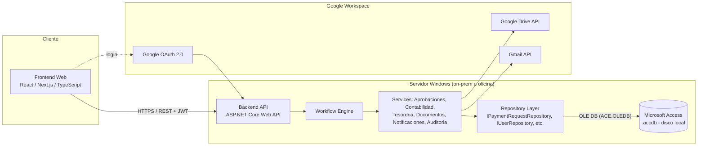

# Propuesta Técnica y Funcional
## Sistema Web de Gestión Documental, Aprobaciones, Contabilidad y Tesorería (Cuentas por Pagar)

**Estado: DOCUMENTO PARA REVISIÓN — NO SE HA ESCRITO CÓDIGO DE APLICACIÓN.**
Este documento responde a los 27 puntos solicitados. Debe ser revisado y aprobado antes de iniciar la Fase 2 (implementación).

---

## 1. Resumen de cómo se entendió el negocio

La empresa necesita reemplazar un proceso manual/semi-manual de cuentas por pagar (hoy soportado en Microsoft Access + Google Drive + correo + Google Workspace) por un **sistema de workflow documental** que controle de punta a punta el ciclo de vida de una obligación de pago:

`RADICACIÓN → REVISIÓN → APROBACIONES → CONTABILIDAD (CAUSACIÓN) → TESORERÍA (PROGRAMACIÓN Y PAGO) → SOPORTE → ARCHIVO → CIERRE`

Puntos clave del entendimiento:

- No es un CRUD: es una **máquina de estados con workflow parametrizable**, donde el cambio de estado es siempre consecuencia de una acción de negocio validada (aprobar, causar, pagar), nunca de una edición directa.
- El **dato financiero** (montos, retenciones, estados, aprobaciones, auditoría) vive en la base de datos transaccional (Access hoy, migrable después). El **archivo físico** (PDF, imágenes) vive en Google Drive; Access sólo guarda metadatos e IDs de Drive.
- Cada rol (Solicitante, Revisor, Aprobador, Contabilidad, Tesorería, Auditor, Administrador) tiene su propia bandeja, permisos y vista de dashboard, con permisos aplicados en frontend **y** backend.
- La empresa **no tiene** SQL Server/PostgreSQL/MySQL hoy — no se puede asumir esa infraestructura para el MVP. La arquitectura debe permitir cambiar el motor de datos después sin reconstruir la aplicación (patrón Repository).
- Prioridades de diseño explícitas del cliente, en este orden: **integridad de la información > seguridad > trazabilidad > segregación de funciones > usabilidad > automatización > estética**. Toda decisión de este documento respeta ese orden.

---

## 2. Diagrama completo del proceso

### 2.1 Flujo de negocio (feliz + devoluciones)

```mermaid
flowchart TD
    A[Solicitante crea SOLICITUD\nBORRADOR] --> B{Documentos\nobligatorios completos?}
    B -- No --> A
    B -- Si --> C[RADICA\nSe genera RAD-AAAA-NNNNNN\nSe crea expediente en Drive]
    C --> D[Motor de Workflow determina\nruta de aprobacion segun\nempresa/monto/proyecto/CC]
    D --> E[PENDIENTE DE REVISION\n(opcional)]
    E --> F[PENDIENTE DE APROBACION\nAprobador 1..N secuencial/paralelo]
    F -- Devuelve --> G[DEVUELTO PARA CORRECCION]
    G --> A
    F -- Rechaza --> H[RECHAZADO\n(fin)]
    F -- Todos aprueban --> I[APROBADO\n-> PENDIENTE DE CAUSACION]
    I --> J[CONTABILIDAD revisa\ny registra CAUSACION\nretenciones + neto a pagar]
    J -- Devuelve --> K[DEVUELTO POR CONTABILIDAD]
    K --> A
    J -- Causa --> L[CAUSADO / PENDIENTE DE PAGO\n-> Notifica Tesoreria]
    L --> M[TESORERIA programa pago]
    M --> N[PAGO PROGRAMADO]
    N --> O[TESORERIA registra pago\n+ soporte]
    O --> P{Saldo pendiente = 0?}
    P -- No --> Q[PAGO PARCIAL]
    Q --> O
    P -- Si --> R[PAGADO]
    R --> S[CERRADO\nExpediente completo en Drive]
```

### 2.2 Máquina de estados (transiciones permitidas)

Ver sección 9 para la tabla completa de transiciones. Regla no negociable (punto 99): **toda transición ocurre solo a través de una acción de workflow validada por el backend**, nunca por edición directa de un campo "estado".

---

## 3. Arquitectura recomendada (con Microsoft Access como base inicial)



**Capas (de arriba hacia abajo, dependencia unidireccional):**

1. **Frontend (SPA)** — solo consume la API HTTPS. Nunca conoce Access, ni Drive, ni Gmail directamente.
2. **API/Controllers** — autenticación, autorización, validación de entrada, orquestación de casos de uso.
3. **Services (lógica de negocio)** — workflow, cálculo de neto a pagar, reglas de documentos obligatorios, segregación de funciones, notificaciones. **Aquí vive la regla de negocio**, no en el frontend ni en el repositorio.
4. **Workflow Engine** — máquina de estados + motor de rutas de aprobación, independiente de la base de datos.
5. **Repositories (Data Access)** — interfaces (`IPaymentRequestRepository`, `IUserRepository`, `IApprovalRepository`, `IAccountingRepository`, `ITreasuryRepository`, `IDocumentRepository`, `IAuditRepository`, …) con una única implementación inicial `Access*Repository`.
6. **Microsoft Access** — archivo `.accdb` en disco **local** del servidor donde corre el backend (nunca en un recurso de red/UNC: es una causa documentada de corrupción del motor Jet/ACE).
7. **Integraciones externas** — Google Drive API (documentos), Gmail API (correo), Google OAuth (login) — todas detrás de interfaces (`IDocumentStorageProvider`, `IEmailSender`, `IAuthProvider`) para poder mockearlas (`INTEGRATION_MODE=mock`) o cambiarlas a futuro.

Este diseño cumple el requisito explícito: el navegador **jamás** toca el archivo `.accdb`; solo habla con la API.

---

## 4. Conexión segura de la aplicación web con Access

**Opción recomendada: ASP.NET Core Web API, ejecutándose como servicio en un equipo/servidor Windows, contra el `.accdb` local mediante OLE DB (`Microsoft.ACE.OLEDB.16.0`) a través de `System.Data.OleDb`.**

| Opción evaluada | Ventajas | Limitaciones | Recomendación |
|---|---|---|---|
| **OLE DB (ACE.OLEDB) desde .NET en Windows** | Driver oficial de Microsoft, mantenido, soporta transacciones, parámetros, es el mismo motor que usa Access Runtime. Rendimiento estable en local. | Solo funciona en Windows; requiere instalar el "Access Database Engine Redistributable" (bitness igual a la del proceso, recomendado 64-bit). | **Elegida** |
| **ODBC (driver Microsoft Access Driver *.mdb, *.accdb)** | Alternativa si OLE DB no está disponible; multiplataforma en teoría. | En Linux/Mac el soporte ODBC para Access es inestable/no oficial (requiere unixODBC + drivers de terceros, poco confiables para producción financiera). | Descartada para el backend principal (podría usarse como *fallback* de emergencia en Windows) |
| **Exponer el `.accdb` directamente al navegador (SMB, WebDAV, etc.)** | Ninguna real. | Sin autenticación de aplicación, sin auditoría, alto riesgo de corrupción por acceso concurrente no controlado, viola el requisito explícito del cliente. | **Rechazada** |
| **Backend en Linux/Node.js contra Access vía puente COM/PowerShell (`node-adodb`, etc.)** | Permitiría stack 100% Node. | Estas librerías dependen de scripts ADO/COM sin mantenimiento activo, requieren Windows igualmente (el puente ejecuta procesos ocultos), y no son aptas para un sistema financiero por fragilidad y falta de soporte. | Descartada |

**Requisitos de la opción elegida:**

- Un **equipo o servidor Windows** (puede ser una máquina física de oficina, una VM, o un servidor Windows en la nube tipo Azure VM/EC2 Windows) que la empresa controle, con:
  - Windows Server 2019+ o Windows 10/11 Pro (mínimo, para pruebas/MVP; Windows Server recomendado para producción).
  - Access Database Engine Redistributable (2016 o superior) de 64 bits instalado.
  - El archivo `.accdb` en disco local (no en unidad de red).
  - El servicio de la API de ASP.NET Core corriendo como **Windows Service** (o IIS con Kestrel detrás), escuchando solo en la red interna o detrás de un reverse proxy/VPN con HTTPS.
- El backend mantiene un **único punto de acceso al archivo** (pool de conexiones controlado por la propia API); ningún otro proceso debe abrir el `.accdb` en modo exclusivo simultáneamente (esto rompe la concurrencia).
- Copias de seguridad automáticas del `.accdb` (ver sección 92) porque es un **archivo único = punto único de falla**.
- Todo acceso pasa por HTTPS con autenticación (JWT emitido tras login con Google OAuth) y autorización por rol/permiso en cada endpoint.

---

## 5. Recomendación: Node.js vs ASP.NET Core

**Recomendación: ASP.NET Core Web API (.NET 8) para el backend.** Frontend se mantiene en React/Next.js/TypeScript (independiente del backend).

| Criterio | Node.js | ASP.NET Core |
|---|---|---|
| Conexión nativa y madura a Access (OLE DB) | No existe driver oficial mantenido; opciones son puentes COM frágiles | `System.Data.OleDb` es de primera clase, mantenido por Microsoft |
| Ejecutar como servicio Windows estable 24/7 | Posible (`node-windows`, pm2), pero menos "nativo" | `sc.exe`/`Windows Service` es soporte de primera clase en .NET |
| Tipado fuerte para lógica financiera crítica (retenciones, neto a pagar, workflow) | TypeScript ayuda, pero en el backend Node suele ser JS o requiere config extra | C# fuertemente tipado de fondo, ideal para cálculos financieros y máquina de estados |
| Camino de migración futura a SQL Server/PostgreSQL | Requiere drivers distintos por motor (pg, mssql, etc.), reescritura de la capa de acceso a datos | Dapper/EF Core soportan Access (vía OLE DB), SQL Server y PostgreSQL con el mismo patrón Repository; el cambio de proveedor es más mecánico |
| Ecosistema Google Workspace (Drive API, Gmail API, OAuth) | Excelente soporte oficial (SDK de Google para Node muy usado) | También tiene SDKs oficiales de Google para .NET, igualmente viables |
| Curva de despliegue en Windows (donde debe vivir Access) | Necesita Node runtime + gestor de procesos en Windows | .NET es first-party en Windows, IIS/Kestrel/Windows Service nativos |
| Talento/mantenimiento a largo plazo | Depende del equipo de la empresa | Depende del equipo de la empresa |

**Conclusión:** dado que el requisito no negociable es Access como base inicial y que el archivo debe vivir en un entorno Windows controlado, ASP.NET Core reduce el riesgo técnico de la integración más crítica y frágil del proyecto (la conexión a Access), sin sacrificar nada en las integraciones con Google. El frontend sigue siendo React/Next.js, comunicándose por REST/JSON — el equipo de frontend no necesita saber nada de .NET ni de Access.

---

## 6 y 7. Modelo de datos para Access y relaciones

Tablas mínimas (nombres en `PascalCase`, PK `Id` autonumérico salvo que se indique lo contrario). Se muestran columnas principales, no exhaustivas.

**Seguridad / usuarios**
- `Usuarios` (Id, GoogleSub, Correo *unique*, Nombre, Activo, UltimoLogin, FechaCreacion)
- `Roles` (Id, Nombre *unique*, Descripcion)
- `Permisos` (Id, Codigo *unique*, Descripcion, Modulo)
- `RolesPermisos` (RolId FK, PermisoId FK) — PK compuesta
- `UsuariosRoles` (UsuarioId FK, RolId FK, EmpresaId FK nullable) — PK compuesta; el `EmpresaId` permite roles distintos por empresa
- `Delegaciones` (Id, TitularId FK Usuarios, SuplenteId FK Usuarios, RolId FK, FechaInicio, FechaFin, Motivo, CreadoPor FK Usuarios)

**Maestros**
- `Empresas` (Id, RazonSocial, Nit *unique*, NombreCorto, Estado, DriveFolderId, ConfiguracionJson)
- `Proveedores` (Id, Nit *unique por empresa*, RazonSocial, NombreComercial, TipoProveedor, Estado, Correo, Telefono, InfoTributariaJson, FechaActualizacion)
- `ProveedoresCuentasBancarias` (Id, ProveedorId FK, Banco, TipoCuenta, NumeroCuentaCifrado, Titular, CertificacionDriveFileId, FechaActualizacion, Vigente)
- `Proyectos` (Id, EmpresaId FK, Codigo, Nombre, ResponsableId FK Usuarios, DirectorId FK Usuarios, Estado)
- `CentrosCosto` (Id, Codigo, Nombre, EmpresaId FK, ProyectoId FK nullable, Estado)
- `Bancos` (Id, EmpresaId FK, Nombre, TipoCuenta, NumeroCuentaCifrado, NombreInterno, Estado, Moneda)
- `TiposSolicitud` (Id, Codigo, Nombre, Activo)
- `TiposDocumento` (Id, Codigo, Nombre, Activo)
- `DocumentosObligatoriosConfig` (Id, TipoSolicitudId FK, TipoDocumentoId FK, EmpresaId FK nullable, ProveedorTipo nullable, MontoDesde nullable, MontoHasta nullable, Obligatorio bit)
- `MotivosDevolucion` / `MotivosRechazo` / `MotivosDiferenciaPago` (Id, Codigo, Texto, Activo)
- `PlantillasCorreo` (Id, Codigo, Asunto, CuerpoHtml, VariablesJson, Activo)
- `ConfiguracionSistema` (Clave *unique*, Valor, Descripcion) — key/value para parámetros (formato de radicado, días "próximo a vencer", horas de recordatorio, etc.)

**Proceso central**
- `SolicitudesPago` (Id, Radicado *unique*, EmpresaId FK, TipoSolicitudId FK, ProveedorId FK, TipoDocumento, NumeroFactura, FechaEmision, FechaVencimiento, Moneda, ValorAntesImpuestos, Iva, ValorBruto, Concepto, ProyectoId FK, CentroCostoId FK, OrdenCompra, Contrato, ResponsableId FK Usuarios, Observaciones, Estado, SolicitanteId FK Usuarios, DriveFolderId, RowVersion *timestamp/versión optimista*, FechaCreacion, FechaRadicacion, EliminadoLogico bit)
- `DocumentosSolicitud` (Id, SolicitudId FK, TipoDocumentoId FK, NombreOriginal, NombreNormalizado, DriveFileId, DriveFolderId, UrlDrive, VersionVigente FK a VersionesDocumentos, EstadoVigente bit, SubidoPorId FK Usuarios, FechaCarga)
- `VersionesDocumentos` (Id, DocumentoId FK, NumeroVersion, DriveFileId, TamanoBytes, MimeType, UsuarioId FK, Fecha, MotivoReemplazo, EsVigente bit)
- `FlujosAprobacion` (Id, EmpresaId FK nullable, Nombre, CondicionJson *reglas: monto/proyecto/CC/tipo*, Activo)
- `PasosFlujo` (Id, FlujoId FK, Orden, TipoPaso *secuencial/paralelo*, ReglaAprobacion *todos/uno/porcentaje/cantidad*, RolRequeridoId FK Roles nullable, UsuarioEspecificoId FK Usuarios nullable)
- `InstanciasAprobacion` (Id, SolicitudId FK, FlujoId FK, PasoActualId FK PasosFlujo, Estado, FechaInicio, FechaFin)
- `Aprobaciones` (Id, InstanciaId FK, PasoId FK, AprobadorId FK Usuarios, ActuaComoSuplenteDeId FK Usuarios nullable, Decision *Aprobado/Rechazado/Devuelto*, Comentario, MotivoDevolucionId FK nullable, Fecha)
- `Causaciones` (Id, SolicitudId FK *unique por causación vigente*, NumeroComprobante, NumeroDocumentoContable, ValorBase, Iva, ValorNeto, FechaCausacion, FechaVencimientoDefinitiva, Observaciones, UsuarioId FK Usuarios, Fecha, DevueltaPorId FK nullable)
- `RetencionesCausacion` (Id, CausacionId FK, Tipo *RETEFUENTE/RETEICA/RETEIVA/OTRA/DESCUENTO*, Base, Porcentaje, Valor)
- `Pagos` (Id, SolicitudId FK, CausacionId FK, FechaPago, BancoId FK Bancos, CuentaBancariaId FK, MedioPago, ValorPagado, ReferenciaBancaria, Observaciones, EstadoPago *Programado/Parcial/Completo*, UsuarioId FK Usuarios, Fecha)
- `DocumentosPago` (Id, PagoId FK, DriveFileId, UrlDrive, NombreArchivo, UsuarioId FK, Fecha)
- `Notificaciones` (Id, UsuarioId FK, Tipo, Titulo, Mensaje, SolicitudId FK nullable, Leida bit, FechaCreacion, FechaLectura, EstadoEnvioCorreo *Pendiente/Enviado/Fallido*)
- `Auditoria` (Id, UsuarioId FK, Fecha, Accion, Modulo, EntidadTipo, EntidadId, ValorAnteriorJson, ValorNuevoJson, Comentario, Resultado, IpOrigen)
- `SecuenciasRadicado` (Clave *ej. "RAD-2026"*, UltimoValor, RowVersion) — tabla dedicada y aislada para el control de concurrencia del consecutivo (ver sección 20)
- `ColaSincronizacion` (Id, TipoOperacion *Drive/Email*, PayloadJson, Intentos, Estado *Pendiente/Fallido/Completado*, UltimoError, FechaCreacion, FechaUltimoIntento) — soporta los puntos 71/72

### 7.1 Relaciones principales

- `SolicitudesPago` es el agregado raíz: 1—N con `DocumentosSolicitud`, `InstanciasAprobacion`, `Causaciones` (normalmente 1, pero se permite histórico si se devuelve y se vuelve a causar), `Pagos`, `Notificaciones`, `Auditoria` (por `EntidadId`).
- `DocumentosSolicitud` 1—N `VersionesDocumentos` (nunca se borra una versión, `EsVigente` marca la actual).
- `FlujosAprobacion` 1—N `PasosFlujo` 1—N `Aprobaciones` (vía `InstanciasAprobacion`).
- `Causaciones` 1—N `RetencionesCausacion`.
- `Pagos` 1—N `DocumentosPago`; `SolicitudesPago` 1—N `Pagos` (soporta pagos parciales, ver sección 14).
- Índices únicos críticos: `SolicitudesPago.Radicado`, `Empresas.Nit`, `Proveedores.Nit+EmpresaId`, `Usuarios.Correo`, `SecuenciasRadicado.Clave`.
- Índices de consulta: `SolicitudesPago(Estado, EmpresaId)`, `SolicitudesPago(ProveedorId, NumeroFactura, FechaEmision, ValorBruto)` (soporta detección de duplicados, punto 17), `Auditoria(EntidadTipo, EntidadId)`.

---

## 8. Matriz de roles y permisos (RBAC)

| Permiso (código) | Solicitante | Revisor | Aprobador | Contabilidad | Tesorería | Auditor | Administrador |
|---|---|---|---|---|---|---|---|
| `solicitud.crear` | ✔ | | | | | | ✔ |
| `solicitud.radicar` | ✔ (propias) | | | | | | ✔ |
| `solicitud.ver.propia` | ✔ | | | | | | ✔ |
| `solicitud.ver.todas` | | ✔ | ✔ | ✔ | ✔ | ✔ | ✔ |
| `aprobacion.decidir` | | | ✔ | | | | ✔* |
| `causacion.registrar` | | | | ✔ | | | ✔* |
| `causacion.devolver` | | | | ✔ | | | ✔* |
| `tesoreria.programar_pago` | | | | | ✔ | | ✔* |
| `tesoreria.registrar_pago` | | | | | ✔ | | ✔* |
| `tesoreria.devolver_contabilidad` | | | | | ✔ | | ✔* |
| `proveedor.ver_datos_bancarios` | | | | ✔ | ✔ | ✔ | ✔ |
| `proveedor.editar` | | | | | | | ✔ |
| `auditoria.ver` | | | | | | ✔ | ✔ |
| `auditoria.modificar` | — | — | — | — | — | — | **nadie** (solo lectura, ver sección 18) |
| `admin.configurar` | | | | | | | ✔ |

`*` el Administrador **funcional** de negocio puede tener estos permisos si el rol se le asigna explícitamente, pero el **administrador técnico** (soporte de sistema) no debe recibir por defecto permisos de decisión financiera — se documenta como regla configurable de segregación de funciones (sección 54).

Reglas de segregación de funciones (parametrizables, motor de reglas, no hardcode):
1. `Solicitud.SolicitanteId == Aprobacion.AprobadorId` → bloqueado salvo excepción configurada por empresa.
2. Un usuario con rol Aprobador no puede tener asignado el permiso `causacion.registrar` sobre la misma solicitud que aprobó (se valida por instancia, no globalmente, porque una persona puede tener ambos roles en la organización pero no debe ejercerlos sobre el mismo caso).
3. `tesoreria.registrar_pago` nunca incluye permisos de edición sobre `Causaciones`/`RetencionesCausacion` (permiso inexistente para ese rol, verificado en backend, no solo oculto en UI).
4. Todo cambio de permisos/roles queda auditado (`Auditoria`, Modulo="RBAC").

**Importante:** la UI oculta botones según permisos, pero **cada endpoint del backend vuelve a validar** el permiso y las reglas de segregación antes de ejecutar la acción — nunca se confía solo en el frontend.

---

## 9. Máquina de estados

| Estado | Puede transicionar a | Disparado por |
|---|---|---|
| BORRADOR | RADICADO, (eliminado lógico) | Solicitante radica |
| RADICADO | PENDIENTE DE REVISIÓN / PENDIENTE DE APROBACIÓN | Sistema (según config: revisión opcional) |
| PENDIENTE DE REVISIÓN | PENDIENTE DE APROBACIÓN, DEVUELTO PARA CORRECCIÓN | Revisor |
| PENDIENTE DE APROBACIÓN | APROBADO (si último paso), PENDIENTE DE APROBACIÓN (siguiente paso), DEVUELTO PARA CORRECCIÓN, RECHAZADO | Aprobador(es) |
| DEVUELTO PARA CORRECCIÓN | RADICADO | Solicitante corrige y re-radica |
| RECHAZADO | *(fin — solo Admin puede reabrir con auditoría)* | — |
| APROBADO | PENDIENTE DE CAUSACIÓN | Sistema (automático) |
| PENDIENTE DE CAUSACIÓN | CAUSADO, DEVUELTO POR CONTABILIDAD | Contabilidad |
| DEVUELTO POR CONTABILIDAD | RADICADO (o PENDIENTE DE APROBACIÓN, según motivo/config) | Solicitante/Sistema |
| CAUSADO (= PENDIENTE DE PAGO) | PAGO PROGRAMADO | Sistema (automático hacia Tesorería) |
| PAGO PROGRAMADO | PAGO PARCIAL, PAGADO, DEVUELTO POR CONTABILIDAD* | Tesorería registra pago |
| PAGO PARCIAL | PAGO PARCIAL (otro abono), PAGADO | Tesorería registra abono adicional |
| PAGADO | CERRADO | Sistema (automático tras cargar soporte) |
| CERRADO | *(fin — consulta/auditoría)* | — |
| ANULADO | *(fin)* | Administrador, con motivo y auditoría, solo desde estados previos a PAGADO |

`*` Tesorería puede devolver a Contabilidad **antes de pagar** si detecta un error en el neto/retenciones (sección 35); una vez pagado no hay devolución, solo ajuste/nota (fuera de alcance del MVP).

Toda fila de esta tabla se implementa como una regla explícita en el Workflow Engine (`origen, destino, permisoRequerido, validaciones[]`), no como `if/else` disperso en la aplicación.

---

## 10. Diseño del motor de aprobaciones

- **Configuración declarativa** en `FlujosAprobacion` + `PasosFlujo`: cada flujo tiene una condición (`CondicionJson`) evaluada contra la solicitud (empresa, monto, proyecto, centro de costo, tipo, proveedor) para decidir qué flujo aplica. Si varias condiciones matchean, gana la más específica (regla de prioridad configurable).
- Al radicar, el motor **resuelve y congela** la instancia de aprobación (`InstanciasAprobacion` + copia de los pasos aplicables) — cambios posteriores a la configuración de flujos no deben alterar solicitudes ya en curso (integridad histórica).
- **Pasos secuenciales**: se activa el paso N+1 solo cuando el paso N está `Aprobado`.
- **Pasos paralelos**: todos los aprobadores del paso se notifican simultáneamente; el paso se resuelve según `ReglaAprobacion`: `TODOS`, `UNO_BASTA`, `CANTIDAD_MINIMA(n)`, `PORCENTAJE_MINIMO(%)`.
- **Rechazo** de cualquier aprobador en un paso paralelo con regla `TODOS` puede configurarse para vetar el paso completo (regla `VETO_UNICO`).
- **Devolución**: al volver a RADICADO tras corrección, la regla configurable (`ReiniciarAprobacionesEnDevolucion`) decide si se reinician **todas** las aprobaciones del flujo o solo las posteriores al paso donde se detectó el problema (por defecto: se reinician desde el paso donde se devolvió en adelante; las aprobaciones previas quedan registradas en el historial como referencia, marcadas `Vigente=false` para el nuevo ciclo).
- **Delegaciones**: al resolver quién debe aprobar un paso, el motor consulta `Delegaciones` vigentes (`FechaInicio<=hoy<=FechaFin`) para el `UsuarioEspecificoId`/rol y sustituye por el suplente, registrando en `Aprobaciones.ActuaComoSuplenteDeId`.
- **Recordatorios/escalamiento**: un job programado (Windows Task Scheduler o `IHostedService` con temporizador en el propio backend .NET) revisa `Aprobaciones` pendientes y genera notificaciones a 24h/48h/72h (parametrizable en `ConfiguracionSistema`); a 72h puede escalar al superior configurado en el paso.

---

## 11. Diseño del módulo de Contabilidad

- Bandeja `PENDIENTE DE CAUSACIÓN` filtrable por empresa, proveedor, proyecto, vencimiento.
- Al abrir una solicitud, Contabilidad ve el expediente completo (documentos + historial de aprobaciones) antes de decidir.
- Acciones disponibles: **Registrar causación** o **Devolver** (con motivo obligatorio de `MotivosDevolucion`, parametrizable).
- El formulario de causación calcula el neto en vivo (sección 12) y permite ajustar retenciones dentro de las reglas configuradas (p. ej. porcentajes sugeridos por tipo de retención, editable, pero **el ajuste manual queda auditado con el valor sugerido vs. el valor final**).
- `REGISTRAR CAUSACIÓN` ejecuta, dentro de una unidad de trabajo (ver sección 20 para el manejo transaccional en Access):
  1. Validar campos obligatorios y reglas (neto ≥ 0, retenciones no negativas, etc.).
  2. Insertar `Causaciones` + `RetencionesCausacion`.
  3. Registrar auditoría (`Modulo=Contabilidad`, valor anterior/nuevo).
  4. Cambiar estado a `CAUSADO/PENDIENTE DE PAGO`.
  5. Encolar notificación a Tesorería (correo + notificación in-app); si falla el envío, se marca `Pendiente` en `Notificaciones`/`ColaSincronizacion` y un job reintenta (sección 72).
- Soporte de causación (comprobante, pantallazo del software contable) se sube al mismo expediente de Drive bajo el prefijo `..._SOPORTE_CAUSACION`.

---

## 12. Diseño de causación y cálculo del neto a pagar

```
VALOR BRUTO
  − RETEFUENTE
  − RETEICA
  − RETEIVA
  − OTRAS RETENCIONES
  − DESCUENTOS
  + OTROS CONCEPTOS (si suman)
= NETO A PAGAR
```

- Cada componente vive como fila en `RetencionesCausacion` (tipo, base, porcentaje, valor) — nunca como un solo campo "retenciones" agregado, para permitir auditoría línea por línea y reportes por tipo de retención.
- El **NETO A PAGAR** se persiste como campo calculado en `Causaciones.ValorNeto` (no solo derivado en tiempo real), para que quede congelado como el valor oficial que ve Tesorería, con trazabilidad si luego se recalcula (nueva fila de causación, la anterior no se borra, ver sección 35/36).
- La UI de causación muestra el desglose completo antes de guardar, con validación: `ValorNeto = ValorBruto − Σ retenciones/descuentos + Σ otros conceptos`, recalculado en backend (nunca se confía en el cálculo hecho en el navegador).

---

## 13. Diseño del módulo de Tesorería

- Bandejas: Por pagar, Programados hoy, Próximos, Vencidos, Parciales, Pagados, Historial.
- Cada fila resalta visualmente el **NETO A PAGAR** (tipográficamente más prominente que el valor bruto) y una **prioridad automática**:
  - 🔴 VENCIDO: `FechaVencimientoDefinitiva < hoy` y saldo > 0.
  - 🟠 VENCE HOY: vence hoy.
  - 🟡 PRÓXIMO A VENCER: dentro de `ConfiguracionSistema["DiasProximoAVencer"]` (default 3, editable).
  - 🟢 EN PLAZO: el resto.
- **Restricción dura de backend**: los endpoints de Tesorería no exponen ninguna operación de escritura sobre `Causaciones`/`RetencionesCausacion` (ni siquiera con permiso de Administrador funcional, salvo el rol explícito de Contabilidad). La única acción disponible ante un error es `DEVOLVER A CONTABILIDAD` con motivo obligatorio, lo que regresa el estado a `DEVUELTO POR CONTABILIDAD`… en este caso específico desde Tesorería, y queda registrado en auditoría con el motivo (sección 35).
- Programar pago (`PAGO PROGRAMADO`) es un paso informativo/planeación, no mueve dinero; registrar pago (sección siguiente) es el que afecta saldos.

---

## 14. Diseño para pagos parciales

- Tabla `Pagos` independiente de `SolicitudesPago` (1—N): cada registro de pago es un abono con su propio banco, cuenta, referencia, soporte y valor.
- Saldo pendiente se calcula siempre como: `Causaciones.ValorNeto − Σ Pagos.ValorPagado` (para la causación vigente de la solicitud).
- Reglas:
  - Si saldo pendiente > 0 tras un pago → estado `PAGO PARCIAL`.
  - Si saldo pendiente = 0 → estado `PAGADO` (dispara cierre automático de expediente, sección 47/49).
  - Si `ValorPagado` de un abono ≠ el saldo pendiente esperado en ese momento, el sistema exige seleccionar un **motivo de diferencia** (`MotivosDiferenciaPago`: pago parcial intencional, ajuste, compensación, retención adicional, error, otro) antes de guardar — no bloquea el pago, pero no permite guardarlo sin motivo cuando la diferencia no es "pago parcial planeado".
  - Nunca se permite que la suma de pagos deje saldo negativo (validación backend, con margen de tolerancia configurable para redondeos).

---

## 15 y 16. Diseño de Google Drive y del expediente documental

- Estructura de carpetas (creada perezosamente, idempotente):
  `CUENTAS POR PAGAR / {Empresa} / {Año} / {Mes - Nombre} / {Radicado} - {Proveedor}`
- Al **radicar** (no al pagar) se crea la carpeta del expediente y se guarda `DriveFolderId` en `SolicitudesPago`. Antes de crear cualquier carpeta o archivo, el servicio de Drive **verifica si el ID ya existe** en la tabla correspondiente (idempotencia, punto 70) — evita duplicados ante reintentos.
- Nomenclatura de archivos: `{Radicado}_{NN}_{TIPO_DOCUMENTO}.{ext}` con `NN` correlativo por tipo/orden de carga.
- Versionamiento: al reemplazar un documento, el archivo anterior **no se borra** en Drive; se sube el nuevo, se marca `EsVigente=false` en la versión anterior y se crea una nueva fila en `VersionesDocumentos`, exigiendo motivo de reemplazo. Usuarios normales ven solo la versión vigente; Auditor/Admin puede ver el histórico completo.
- **Detección de duplicados de factura**: antes de radicar, se consulta por coincidencia de (Empresa, Proveedor/NIT, NúmeroFactura, FechaEmisión, ValorBruto). Si hay match, se muestra advertencia con enlace a la solicitud existente; continuar exige un permiso de excepción y queda auditado (no bloquea absolutamente, según punto 17).
- **Resiliencia ante fallas de Drive**: toda operación de Drive se ejecuta a través de un servicio con reintentos; si falla, la solicitud **no se pierde**: se guarda en Access con estado documental `SINCRONIZACIÓN PENDIENTE` y el job de la `ColaSincronizacion` reintenta en segundo plano hasta confirmar éxito (idempotente por diseño).
- `INTEGRATION_MODE=mock` reemplaza el servicio real por uno que genera IDs/URLs simulados y no llama a Google — usado en desarrollo/demo.

---

## 17. Estrategia de Gmail / correo

- Envío vía **Gmail API** con **cuenta de servicio + delegación de dominio (domain-wide delegation)** de Google Workspace, actuando en nombre de una casilla corporativa (p. ej. `cuentasporpagar@empresa.com`), o alternativamente OAuth de una cuenta dedicada — a decidir con el administrador de Workspace de la empresa (requiere que un Super Admin de Workspace autorice el scope `gmail.send`).
- Notificación en cada transición relevante del workflow (creación, radicación, aprobación pendiente, aprobado, devuelto, rechazado, llega a contabilidad, causado, llega a tesorería, programado, pagado, soporte cargado, cerrado) — lista exacta ya definida en el requerimiento (puntos 27–28, 48).
- **Plantillas editables** (`PlantillasCorreo`) con variables `{{radicado}}`, `{{proveedor}}`, `{{empresa}}`, `{{valor}}`, `{{vencimiento}}`, `{{usuario}}`, `{{urlSolicitud}}` — administrables sin tocar código.
- Los correos **enlazan** a la solicitud dentro del sistema (URL autenticada); no se adjuntan documentos financieros salvo excepción expresa configurada.
- **Resiliencia**: si el envío falla, no se bloquea el flujo principal; se marca `Notificaciones.EstadoEnvioCorreo=Fallido` y se reintenta vía `ColaSincronizacion`, igual que Drive.
- `INTEGRATION_MODE=mock` registra el correo "enviado" en un log/tabla sin llamar a Gmail real.

---

## 18. Estrategia de auditoría

- Tabla `Auditoria` **append-only** desde la aplicación: no existe endpoint de edición ni borrado sobre esta tabla, ni siquiera para Administrador (solo lectura vía API; cualquier necesidad de "corrección" de auditoría requeriría acceso directo a la base de datos fuera de la aplicación, lo cual queda fuera del alcance y se documenta como riesgo aceptado a vigilar).
- Se registra automáticamente en cada Service (no en el controlador, para no depender de que cada endpoint lo recuerde) — se implementa como parte del patrón de casos de uso: toda operación de escritura relevante pasa por un `IAuditService.Registrar(...)` con `usuario, acción, módulo, entidad, valorAnterior (JSON), valorNuevo (JSON), comentario, resultado`.
- Eliminación **lógica** únicamente (`EliminadoLogico` bit) para entidades financieras críticas (`SolicitudesPago`, `Causaciones`, `Pagos`, `Proveedores`); nunca `DELETE` físico desde la aplicación.
- El módulo de Auditoría (rol Auditor/Administrador) permite filtrar por usuario, módulo, entidad, rango de fecha, y ver el detalle de "antes/después" en formato legible.

---

## 19. Seguridad

- **Autenticación**: Google OAuth 2.0 ("Continuar con Google"), restringido opcionalmente al dominio de Workspace (`hd` claim). Tras validar el token de Google, el backend verifica que el correo exista y esté `Activo` en `Usuarios` — si no, acceso denegado aunque el login de Google sea válido. Se emite un JWT propio de sesión (corto, p. ej. 30–60 min, con refresh) para las llamadas a la API — la autenticación queda desacoplada del resto de la app vía una interfaz `IAuthProvider`.
- **Autorización**: RBAC verificado en cada endpoint (policy-based authorization de ASP.NET Core), nunca solo en el frontend.
- **Transporte**: HTTPS obligatorio en todo ambiente distinto a desarrollo local; cookies de sesión (si se usan) con `HttpOnly`, `Secure`, `SameSite=Strict/Lax`.
- **Validación de entrada**: DTOs con validación estricta (data annotations/FluentValidation), sanitización de nombres de archivo antes de subir a Drive, whitelist de extensiones/MIME permitidos, límite de tamaño por archivo y por solicitud.
- **Protección estándar**: anti-CSRF donde aplique (formularios con cookies), cabeceras de seguridad (CSP, X-Content-Type-Options, etc.), protección contra XSS (sanitización de salida, el framework de frontend ya escapa por defecto), parámetros preparados en toda consulta a Access (nunca concatenación de SQL — previene inyección), rate limiting en endpoints sensibles (login, carga de archivos).
- **Datos sensibles**: número de cuenta bancaria de proveedores se guarda cifrado en reposo (o al menos enmascarado en toda respuesta de API salvo para roles autorizados: `********4582`); toda consulta/edición de datos bancarios queda auditada específicamente.
- **Gestión de secretos**: credenciales de Google (client secret, service account key) solo en variables de entorno / almacén de secretos del servidor, nunca en el repositorio (`.env.example` sin valores reales).

---

## 20. Manejo de concurrencia con Access

Riesgos concretos y mitigación:

1. **Radicados duplicados**: nunca `SELECT MAX(...) + 1` sin control. Se usa la tabla dedicada `SecuenciasRadicado` con:
   - Transacción corta (`BEGIN TRAN` OLE DB) que lee y actualiza el contador en la misma operación, **más** un `lock` a nivel de aplicación (semáforo/`SemaphoreSlim` en el proceso backend, ya que hay una única instancia de API hablando con el archivo) que serializa exclusivamente esta operación puntual — es la combinación más segura dado que Access no soporta `SELECT ... FOR UPDATE` real.
   - Índice único en `SolicitudesPago.Radicado` como última barrera: si por cualquier causa se genera un choque, el `INSERT` falla por violación de índice único y el servicio reintenta generando el siguiente consecutivo (patrón *retry-on-conflict*).
2. **Aprobaciones/causaciones/pagos simultáneos sobre la misma solicitud**: control de **concurrencia optimista** vía columna de versión (`RowVersion`/timestamp) en `SolicitudesPago` — toda actualización de estado incluye `WHERE Id=@id AND RowVersion=@version`; si 0 filas afectadas, se asume conflicto y se responde "esta solicitud fue modificada por otro usuario, recargue" en vez de sobrescribir silenciosamente.
3. **Escrituras concurrentes generales**: Access maneja bloqueo a nivel de página (archivo `.laccdb`); se minimiza el tiempo de las transacciones (abrir, ejecutar, cerrar rápido; no mantener conexiones abiertas mientras el usuario piensa), se usa un pool de conexiones pequeño y controlado desde el backend, y se implementan reintentos automáticos con backoff ante errores típicos de Access (`3260 - No se pudo actualizar; bloqueada actualmente por otro usuario`).
4. Todas las operaciones críticas (radicar, aprobar, causar, registrar pago) se ejecutan como **una única transacción de negocio** en el backend (no varias llamadas sueltas desde el frontend), reduciendo la ventana de inconsistencia.

---

## 21. Riesgos técnicos de usar Access

| Riesgo | Detalle | Mitigación en este diseño |
|---|---|---|
| Concurrencia limitada | Access/Jet-ACE está pensado para pocas decenas de usuarios simultáneos, con degradación notable en escrituras concomitantes | Backend único como intermediario, transacciones cortas, colas para operaciones no críticas en tiempo real |
| Tamaño máximo de archivo | 2 GB por archivo `.accdb` (límite duro del motor) | No guardar binarios (Drive los aloja); monitorear tamaño de archivo como indicador (sección 22); diseño listo para migrar antes de acercarse al límite |
| Corrupción de archivo | Riesgo real ante cortes de energía, acceso por red (UNC/SMB), o múltiples procesos abriendo el archivo | Archivo en disco local del servidor, un único proceso backend accede a él, respaldos automáticos frecuentes, UPS recomendado |
| Sin auditoría/triggers nativos robustos | Access no ofrece triggers como SQL Server | Toda regla de auditoría/negocio vive en la capa de Services de la aplicación, no se depende del motor de datos |
| Consultas pesadas / reportes grandes | Con el tiempo, agregaciones/reportes pueden volverse lentas | Índices cuidadosamente diseñados (sección 7); reportes pesados como procesos asíncronos/exportación, no consultas síncronas bloqueando la UI |
| Sin alta disponibilidad / replicación nativa | Un solo archivo, un solo servidor | Aceptado como limitación conocida del MVP; documentado como disparador de migración (sección 22-23) |
| Backend Windows-only | El proceso que habla con Access requiere Windows | Aceptado: es el costo necesario de usar Access hoy; el resto de la arquitectura (frontend, integraciones) es independiente de esa restricción |

Ninguno de estos riesgos se "ignora": se documentan explícitamente y se diseña la salida (Repository pattern + migración documentada, sección 23).

---

## 22. Umbral aproximado de usuarios/concurrencia e indicadores a vigilar

Como referencia de la industria (no garantía): Access/ACE tiende a mostrar degradación notoria por encima de **~15–25 usuarios concurrentes activos** (no licencias totales, sino personas trabajando al mismo tiempo con operaciones de escritura), y se vuelve claramente inadecuado por encima de ~50 concurrentes o cuando el archivo se acerca a **1.2–1.5 GB** (dejando margen antes del límite de 2 GB).

Indicadores a monitorear desde el día 1 (deben quedar en logs/dashboard técnico):

- Tamaño actual del archivo `.accdb` (alerta al 60% y 80% del límite de 2 GB).
- Frecuencia de errores de bloqueo (`3260`/timeouts) por día — un incremento sostenido es la señal más temprana.
- Tiempo de respuesta p95 de operaciones de escritura (radicar, aprobar, causar, pagar).
- Número de usuarios concurrentes reales en horas pico (medible por sesiones activas del backend).
- Cantidad de solicitudes activas (no cerradas) y volumen mensual de radicados — crecimiento del volumen es proxy directo de crecimiento del archivo y de contención.
- Frecuencia necesaria de compactar/reparar la base — si se vuelve rutina semanal, es señal de estrés del motor.

Regla práctica recomendada: iniciar el plan de migración (sección 23) cuando se supere **cualquiera** de: 20 usuarios concurrentes sostenidos, 1.2 GB de archivo, o más de ~5 errores de bloqueo/día reportados por el sistema.

---

## 23. Estrategia de migración futura de Access

Gracias al patrón Repository, la migración no reconstruye la aplicación:

1. Definir e implementar `SqlServerPaymentRequestRepository` (o `PostgreSqlPaymentRequestRepository`, etc.) implementando exactamente las mismas interfaces (`IPaymentRequestRepository`, `IApprovalRepository`, …) usadas hoy por `Access*Repository`.
2. Crear el esquema equivalente en el motor destino a partir del modelo de datos aquí documentado (sección 6-7), que ya está diseñado en forma relacional estándar (evita en lo posible particularidades exclusivas de Access).
3. Migrar datos históricos con un script de extracción/carga (ETL simple) validado con conteos y sumas de control (totales de valor bruto/neto por empresa, por ejemplo) antes/después.
4. Cambiar la configuración de inyección de dependencias (un único punto: el registro de repositorios en el arranque de la API) para apuntar a la nueva implementación — **cero cambios** en Controllers, Services, Workflow Engine ni Frontend.
5. Ejecutar en paralelo (modo sombra) un periodo corto, comparando resultados entre ambos repositorios antes del corte definitivo.
6. Mantener Access como respaldo de solo lectura por un periodo de transición.

Este plan se documentará en detalle (con scripts de referencia) en `docs/database-migration.md` durante la Fase 2, sin que eso implique introducir SQL Server/PostgreSQL como requisito del MVP.

---

## 24. Estructura propuesta de pantallas

```
Login (Continuar con Google)
Dashboard (según rol)
├── Solicitudes
│   ├── Nueva solicitud (wizard: datos generales → documentos → revisión → radicar)
│   ├── Mis solicitudes (tabla filtrable/paginada)
│   ├── Borradores
│   └── Devueltas
├── Aprobaciones
│   ├── Pendientes de mi aprobación
│   └── Historial (aprobadas/rechazadas por mí)
├── Contabilidad
│   ├── Pendientes de causación
│   ├── Causadas
│   └── Devueltas
├── Tesorería
│   ├── Por pagar / Programados / Vencidos
│   └── Pagados / Historial
├── Documentos
│   └── Buscador global de expedientes
├── Expediente (vista de detalle de una solicitud — accesible desde cualquier bandeja)
│   ├── Datos generales | Documentos | Aprobaciones | Contabilidad | Tesorería | Pagos | Timeline | Auditoría (según permiso)
├── Notificaciones (campana con contador)
├── Reportes (exportables)
└── Administración
    ├── Usuarios / Roles / Permisos / Delegaciones
    ├── Empresas / Proveedores / Proyectos / Centros de costo
    ├── Bancos / Cuentas bancarias
    ├── Tipos de solicitud / documento / Documentos obligatorios
    ├── Flujos de aprobación / Límites
    ├── Motivos (devolución/rechazo/diferencia de pago)
    ├── Plantillas de correo / Recordatorios
    └── Configuración general / Google Drive
```

El menú lateral se renderiza dinámicamente según los permisos del usuario autenticado (el backend expone qué módulos/acciones puede ver, el frontend no decide eso por sí solo).

---

## 25. Plan de desarrollo por fases

| Fase | Contenido |
|---|---|
| 0 | Análisis (este documento) |
| 1 | Arquitectura detallada, setup de repos, entornos, `.env.example`, esqueleto de proyectos (frontend/backend) |
| 2 | Capa Access + Repository (esquema de BD, migraciones/scripts de creación, repos base, `INTEGRATION_MODE=mock`) |
| 3 | Autenticación (Google OAuth) + Usuarios + Roles + Permisos (RBAC) |
| 4 | Maestros: Empresas, Proveedores (+ cuentas bancarias), Proyectos, Centros de costo, Bancos |
| 5 | Solicitudes + Documentos + Drive simulado (mock) + radicado con control de concurrencia |
| 6 | Motor de workflow (máquina de estados genérica) |
| 7 | Motor de aprobaciones (flujos, pasos, delegaciones, recordatorios) |
| 8 | Módulo Contabilidad (bandeja, devoluciones) |
| 9 | Causación + cálculo de neto a pagar + retenciones |
| 10 | Módulo Tesorería (bandejas, prioridades, programación) |
| 11 | Registro de pagos + soportes + pagos parciales |
| 12 | Integración real con Google Drive |
| 13 | Integración real con Gmail + plantillas |
| 14 | Dashboard general + reportes + exportación |
| 15 | Auditoría end-to-end + endurecimiento de seguridad |
| 16 | Pruebas (unitarias, integración, los 10 casos del punto 86) |
| 17 | Preparación para producción (despliegue, respaldos, monitoreo, documentación final) |

Cada fase entrega algo demostrable; no se avanza a la siguiente sin validar la anterior con el cliente.

---

## 26. Alcance del MVP vs. Versión 2

**Incluido en MVP** (validar el proceso principal completo):
Login con Google, usuarios/roles básicos, creación y radicado de solicitudes con documentos obligatorios dinámicos, expediente en Drive (real o mock según disponibilidad de credenciales), motor de aprobación con flujos por monto/empresa (secuencial y paralelo simple), devoluciones/rechazos con motivo, causación con retenciones y neto a pagar, control de que Tesorería no edite causación, programación y registro de pago (incluye parciales), soporte de pago obligatorio, cierre automático de expediente, timeline/historial, notificaciones in-app y por correo de los hitos principales, auditoría básica, detección de facturas duplicadas (alerta, no bloqueo), datos de prueba y `INTEGRATION_MODE=mock`.

**Diferido a Versión 2 / posteriores** (preparado arquitectónicamente pero no implementado):
Delegaciones/suplencias con UI completa de administración (se puede dejar el modelo de datos listo desde el MVP), escalamiento automático multi-nivel, dashboard con gráficas avanzadas y KPIs de tiempos de ciclo, reportes exportables completos (se puede dejar 1-2 reportes básicos en MVP y ampliar después), buscador documental avanzado con múltiples filtros combinados, módulo de posición de caja/saldos bancarios, presupuesto vs. ejecutado, órdenes de compra/contratos como módulos propios, anticipos/legalizaciones como flujo independiente, integraciones con ERP/software contable/APIs bancarias/Power BI/Looker Studio, nómina. Ninguno de estos se bloquea a futuro: el modelo de datos y la capa de servicios dejan espacio (tablas y interfaces adicionales) sin necesitar romper lo ya construido.

---

## 27. Riesgos y requisitos adicionales a considerar

- **Riesgo contable/financiero**: el cálculo del neto a pagar y las retenciones debe validarse con el equipo contable real de la empresa (porcentajes vigentes de RETEFUENTE/RETEICA/RETEIVA cambian por normativa) — se recomienda que estos porcentajes sean parametrizables por tabla, no fijos en código, y que Contabilidad los revise antes de ir a producción.
- **Riesgo de continuidad**: al ser un archivo único, se requiere definir **quién y con qué frecuencia** se hace el respaldo del `.accdb`, dónde se guarda (idealmente también replicado a Drive/almacenamiento externo cifrado) y una prueba periódica de restauración — un respaldo nunca probado no es un respaldo confiable.
- **Requisito organizacional**: se necesita que un administrador de Google Workspace habilite el proyecto en Google Cloud Console, cree las credenciales OAuth y (si se usa domain-wide delegation para Gmail) autorice los scopes correspondientes — esto es un paso administrativo fuera del código que debe planearse con tiempo.
- **Requisito legal/normativo**: si la empresa maneja datos personales/financieros de proveedores, verificar requisitos locales de protección de datos (habeas data) para el manejo de cuentas bancarias e información tributaria, especialmente en logs y exportaciones.
- **Riesgo de adopción**: un sistema de workflow con controles estrictos (segregación de funciones, documentos obligatorios) puede encontrarse con resistencia si los datos maestros (proveedores, proyectos, centros de costo) no están limpios antes de migrar desde Access/Excel actuales — se recomienda una fase de depuración de maestros antes de la puesta en producción.
- **Requisito operativo**: definir formalmente el "dueño" de la máquina Windows que aloja Access — parches de sistema operativo, antivirus con exclusiones correctas sobre el archivo `.accdb` (el antivirus escaneando el archivo en cada acceso es una causa común de lentitud/corrupción), y ventana de mantenimiento.
- **Punto abierto para decisión del cliente**: confirmar si existe ya un servidor/PC Windows disponible para alojar el backend + Access, o si debe aprovisionarse (física u on-prem vs. VM Windows en la nube).

---

### Cierre

Este documento no incluye código de aplicación, conforme a lo solicitado. Queda pendiente de revisión y aprobación explícita antes de iniciar la Fase 2 (implementación de la capa Access + Repository).
